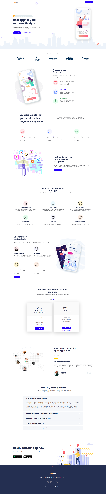

## AppLab Theme

---
Thank you for using AppLab See the "public" folder, you will find everything ready to use there. If you want to use the gulp based workflow, cd to this directory in your terminal and run this command: npm i && gulp